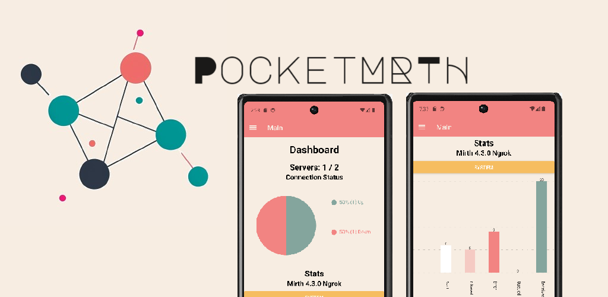
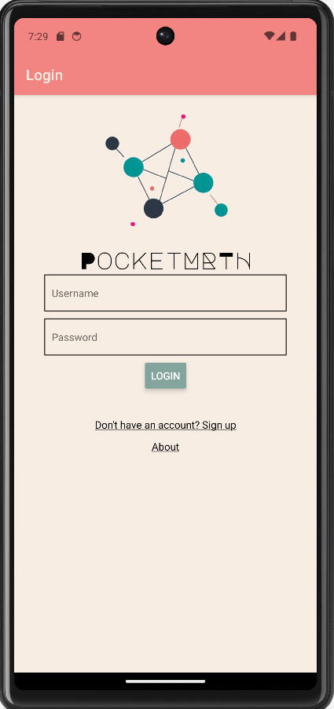
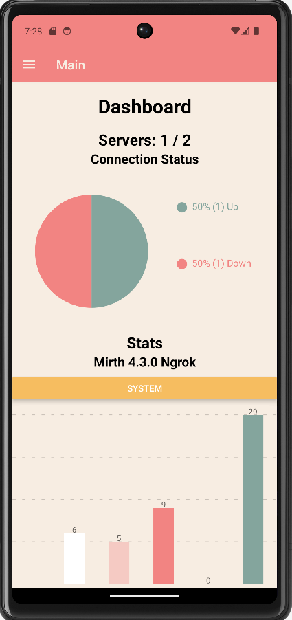
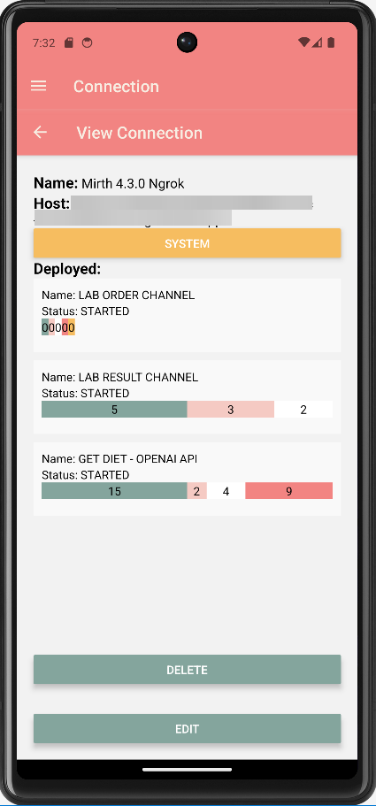

# PocketMRTH - Your Mirth Connect Companion

PocketMRTH is a free mobile app created in React Native and Expo.dev. It allows you to view and monitor your Mirth Connect instance and its channel statistics on the go.

## Features

- No External API Service: PocketMRTH operates independently without relying on external API services.
- Local Data Storage: Your data is securely stored on your device, enhancing privacy and security.
- Two-Factor Authentication (2FA) Option: We've integrated 2FA for added security.
- Secure Credential Storage: Your Mirth Connect Client API credentials are safely stored using Expo's SecureStore.
- Effortless Channel Stats Visualization: Use the app's intuitive charts to visualize the status of your Mirth Connect servers and their channel statistics.

## Screenshots

## Privacy Policy Link
[Privacy Policy Link](https://raw.githubusercontent.com/litemikx/pocketmrth/master/docs/privacy-policy.md)

## Support
If you encounter any issues, feel free to open an issue here. 

If you have any questions or concerns, please contact me at charmiequino@gmail.com or visit my website at https://litemikx.github.io/heymikko/.

