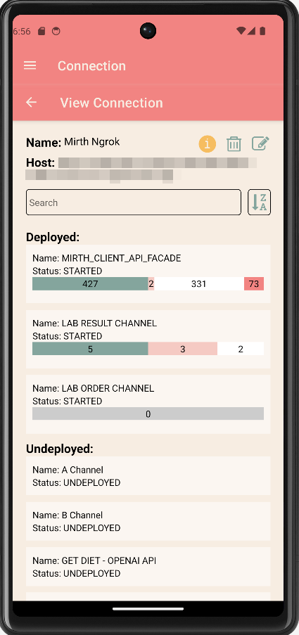

# PocketMRTH - Your Mirth Connect Companion

PocketMRTH is a free mobile app created in React Native and Expo.dev. It allows you to view and monitor your Mirth Connect instance and its channel statistics on the go.

## Download

## Getting Started

Tutorial link here: [PocketMRTH - Get Started](https://thisdevblogs.wordpress.com/2023/09/18/pocketmrth-a-mobile-app-to-monitor-your-mirth-connect/)

## Features
- No External API Service: PocketMRTH operates independently without relying on external API services.
- Local Data Storage: Your data is securely stored on your device, enhancing privacy and security.
- Two-Factor Authentication (2FA) Option: We've integrated 2FA for added security.
- Secure Credential Storage: Your Mirth Connect Client API credentials are safely stored using Expo's SecureStore.
- Effortless Channel Stats Visualization: Use the app's intuitive charts to visualize the status of your Mirth Connect servers and their channel statistics.

## Screenshots

## Video Demo
[PocketMRTH - DEMO](https://www.youtube.com/watch?v=dNSfR93Cq-4)

## Privacy Policy Link
[Privacy Policy Link](https://raw.githubusercontent.com/litemikx/pocketmrth/master/docs/privacy-policy.md)

## LICENSE
[LICENSE](https://raw.githubusercontent.com/litemikx/pocketmrth/master/LICENSE)

## Support
If you encounter any issues, feel free to open an issue here. 

If you have any questions or concerns, please contact me at charmiequino@gmail.com or visit my website at https://litemikx.github.io/heymikko/.

## Acknowledgments
Thank you for the following open source projects that made this app possible:
- [Expo](https://expo.dev/)
- [React Native](https://reactnative.dev/)
- [React Native Chart Kit](https://www.npmjs.com/package/react-native-chart-kit)
- [otplib](https://github.com/yeojz/otplib)

### If you like this or want to support my side projects, like this one, you can:

